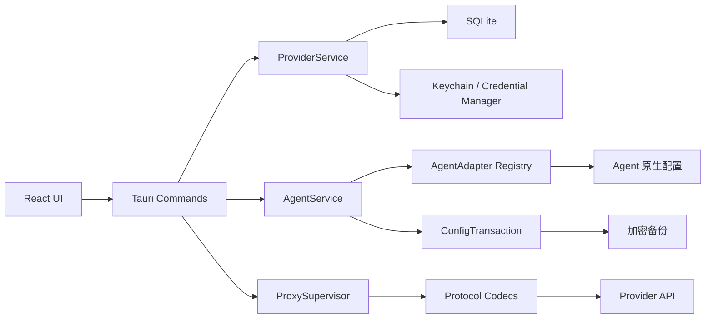

<p align="center">
  
</p>

<h1 align="center">AT-Switch</h1>

<p align="center">
  <a href="https://github.com/atswitch/at-switch/actions/workflows/ci.yml"></a>
  <a href="./LICENSE"></a>
  
</p>

AT-Switch 是一款面向 macOS 和 Windows 的本地 AI Agent Provider 与模型切换工具。
它将不同 Agent 的配置方式统一为同一套桌面工作流：选择 Agent、维护 Provider、
选择模型，然后默认以直连方式完成切换。需要协议转换或密钥隔离时，可在高级设置
中启用本地代理。

项目采用 Tauri 2、Rust、React 和 TypeScript 构建。Provider API Key 保存在
macOS Keychain 或 Windows Credential Manager；应用直连配置时，真实 Key 会按目标
Agent 的原生格式写入其配置文件。AT-Switch 不持久化 Prompt、模型回复或逐条 API
请求日志。

## 功能特性

- 集中维护多个 Provider 及其模型目录；
- 按 Agent 独立保存当前 Provider、模型和接入方式；
- 在 Agent 原始配置与 AT-Switch 托管配置之间切换；
- 首页仅提供 Agent 直连并作为默认路径；本地代理位于高级设置；
- 支持 OpenAI Chat Completions、OpenAI Responses 和 Anthropic Messages；
- 支持协议间转换、流式输出（Streaming）和工具调用（Tool Calling）；
- 文本模型的验证结果独立持久化；生图、语音和视频模型无需连接测试且不显示验证状态；
- 新建同名且同 Endpoint 的 Provider 时自动合并模型目录，避免重复卡片；
- Agent 配置写入前创建加密备份，并执行原子替换、写后校验和失败回滚；
- 启动、窗口重新获得焦点和手动刷新时自动检测已安装 Agent；
- Agent 运行中切换配置时安全退出并重新启动；未运行时在下次启动时生效；
- 支持简体中文与 English 即时切换，语言偏好随应用设置持久化；
- 非首页页面提供左上角返回按钮，并按访问顺序逐级返回；
- 支持一键恢复 AT-Switch 接管前的 Agent 原始配置。

## 支持平台

| 平台 | 最低版本 | 自动发现来源 | 构建产物 |
| --- | --- | --- | --- |
| macOS | macOS 12 | `/Applications`、`~/Applications`、Bundle ID、Spotlight、运行进程、`PATH` | Apple Silicon、Intel、Universal `.app` / `.dmg` |
| Windows | Windows 10/11 | `%LOCALAPPDATA%`、Program Files、App Paths 注册表、运行进程、`PATH` | x64 `.exe` / NSIS 安装器 |

macOS 和 Windows 使用同一套 Agent 注册、扫描、状态判断、配置事务和切换流程。
平台差异仅封装在安装位置发现、凭据存储和进程生命周期控制中。用户从标准安装器
安装 Agent 后，AT-Switch 会在启动时自动识别；点击“刷新状态”会立即重新扫描。
macOS 或 Windows 上安装在非标准目录、且系统索引、注册信息、`PATH` 与运行进程均未
暴露应用位置时，可以在首页未识别提示、“智能体状态”页或智能体配置详情中选择安装
位置。AT-Switch 校验所选目录中的 Agent 主程序后保存该路径；路径失效时会提示重新
选择，也可以随时恢复自动发现。

CI 在 `macos-14` 和 `windows-2022` 上执行前端构建、前端测试、Rust 格式检查、
Clippy、Rust 测试和 Tauri 桌面链接检查。

## Agent 支持矩阵

| Agent | 自动检测 | 自动配置 | 默认请求协议 | 配置说明 |
| --- | --- | --- | --- | --- |
| WorkBuddy | macOS / Windows | 支持 | OpenAI Chat Completions | 维护 `~/.workbuddy/models.json`，默认启用图片与可关闭的思考模式，并同步当前会话与新会话模型选择 |
| CodeBuddy CN | macOS / Windows | 支持 | OpenAI Chat Completions | 维护 `~/.codebuddy/models.json`，同步工作区默认值与当前会话选择，并保留用户模型和根级字段 |
| QClaw | macOS / Windows | 支持 | OpenAI Chat Completions | 根据 `~/.qclaw/qclaw.json` 定位并更新 OpenClaw 配置 |
| AutoClaw | macOS / Windows | 支持 | OpenAI Chat Completions | 更新 Electron 用户数据目录中的权威模型设置 |
| Codex | macOS / Windows | 支持 | OpenAI Responses | 更新 `$CODEX_HOME/config.toml` 或 `~/.codex/config.toml`，保留其他 TOML 配置和注释 |
| ima | macOS / Windows | 仅检测 | OpenAI Chat Completions | 自定义模型由 ima 登录态服务管理，AT-Switch 不读取 Cookie 或调用未公开接口 |
| TRAE | macOS / Windows | 仅检测 | OpenAI-compatible 自定义模型 | 自定义模型由 TRAE 登录态内部存储管理，AT-Switch 不改写未公开的内部数据库 |

主模型切换器包含 WorkBuddy、CodeBuddy CN、QClaw、AutoClaw 和 Codex。ima 与 TRAE
显示在 Agent 状态页，用于安装、运行状态和版本检测。

## 直连与本地代理

首页只提供直连模型切换。这样可以减少运行依赖和网络中间层；本地代理保留为高级
兼容能力，不会在协议匹配时默认启用。

### 本地代理

本地代理只监听 `127.0.0.1`。Agent 配置中保存高熵本地路由令牌，真实 Provider
API Key 仍由系统凭据库保管。请求协议与 Provider 协议不一致时，代理通过规范化
中间模型完成转换；协议一致时透明转发，并只替换当前选中的模型。

本地代理适合以下场景：

- 不希望把真实 API Key 写入 Agent 配置文件；
- Provider 与 Agent 使用不同 API 协议；
- 需要在多个 Provider 或模型之间频繁切换；
- 希望统一使用流式输出和工具调用兼容层。

### Agent 直连

直连模式将 Provider Endpoint、API Key 和模型写入 Agent 原生配置，请求不经过
AT-Switch。直连要求 Provider 原生支持 Agent 使用的协议：

- Codex 默认使用 `/v1/responses`；
- WorkBuddy、CodeBuddy CN、QClaw 和 AutoClaw 默认使用
  `/v1/chat/completions`；
- Anthropic Messages Provider 可通过本地代理供 OpenAI 协议 Agent 使用。

两种模式共用同一 Provider 和模型目录。首页模型切换固定使用直连；本地代理的启停、
端口和 Agent 接管配置统一位于“高级设置 → 本地代理”。切换接入方式时 AT-Switch
会重新生成目标 Agent 配置、校验写入结果，并按需重启 Agent。

## 使用流程

1. 启动 AT-Switch。应用自动扫描本机已安装的 Agent。
2. 进入“模型供应商与大模型”，点击“新建模型供应商”。选择内置供应商时会自动填入
   官方常用 Endpoint、协议和模型建议；Endpoint 与模型 ID 仍可按实际账号自由修改。
   然后填写 API Key。
3. 文本模型执行连接测试，按模型能力检查普通响应、流式输出和工具调用；生图、语音和
   视频模型无需测试。
4. 在顶部选择目标 Agent。
5. 点击模型右侧的“切换”，以直连方式应用。
6. Agent 正在运行时确认重启；未运行时直接保存配置。
7. 如需恢复登录态、自带模型或 Auto 模式，选择“Agent 原始配置”。
8. 仅在需要跨协议转换或密钥隔离时，进入“高级设置 → 本地代理”。
9. 如需英文界面，进入“高级设置 → 语言”选择 `English`；切换立即生效。

写入各 Agent 的自定义模型统一保留真实模型 ID，不拼接 AT-Switch 内部标识。
CodeBuddy CN 同时使用 Provider 名作为显示名称，因此菜单显示为“Provider 名:模型 ID”，
但请求仍发送真实模型 ID。

详细操作见 [使用教程](./docs/使用教程.md)。

## 架构概览



核心设计：

- `AgentAdapter` 隔离每个 Agent 的发现、协议能力、配置生成和写后校验；
- `DiscoveryContext` 在运行时解析用户目录、系统应用目录、注册表、运行进程和
  `PATH`，不包含开发机绝对路径；
- Agent 配置写入统一经过“加密备份 → 备份校验 → 同目录原子替换 → 写后校验”；
- 第一次接管时保存不可变基线，用于恢复 Agent 原始配置；
- Provider 元数据与 Secret 分离保存；
- 本地代理使用每个 Agent 独立的本地令牌，路由表只保存令牌哈希；
- 协议匹配由 Agent 能力驱动，新增协议时通过 Codec 和能力矩阵扩展。

完整设计见 [架构设计](./docs/架构设计.md) 和
[本地代理与直连模式设计](./docs/本地代理与直连模式设计.md)。

## 目录结构

```text
at-switch/
├── src/
│   ├── components/                    # React 通用组件与业务表单
│   ├── pages/                         # Switchboard、Agent、Provider、代理和设置页面
│   ├── lib/                           # Tauri IPC、能力矩阵和格式化工具
│   ├── assets/agents/                 # 随安装包发布的 Agent 图标
│   ├── App.tsx                        # 应用状态、命令编排和弹窗流程
│   ├── types.ts                       # 前后端数据契约
│   └── styles.css                     # 全局桌面样式
├── src-tauri/
│   ├── src/
│   │   ├── agents/                    # Agent 发现、适配、配置和生命周期
│   │   ├── proxy/                     # 本地 HTTP 代理与协议 Codec
│   │   ├── services/                  # Provider 服务与配置事务
│   │   ├── infrastructure/            # SQLite 和系统凭据库
│   │   ├── domain/                    # 领域模型与错误类型
│   │   ├── commands.rs                # Tauri IPC 命令
│   │   └── lib.rs                     # 桌面应用初始化
│   ├── capabilities/                  # Tauri 权限声明
│   ├── icons/                         # macOS、Windows 和移动端图标源
│   ├── Cargo.toml
│   └── tauri.conf.json
├── docs/                              # PRD、架构、使用与发布文档
├── .github/workflows/ci.yml           # macOS / Windows CI
├── AGENTS.md                          # 开发与迭代规范
├── package.json
└── README.md
```

## 本地开发

### 环境要求

- Node.js 20+
- npm 10+
- Rust stable 1.85+
- macOS 12+ 或 Windows 10/11
- [Tauri 2 平台依赖](https://v2.tauri.app/start/prerequisites/)

### 安装依赖

```bash
git clone https://github.com/atswitch/at-switch.git
cd at-switch
npm ci
```

### 启动开发环境

浏览器 Mock：

```bash
npm run dev
```

真实 Tauri 桌面应用：

```bash
npm run tauri:dev
```

安装版 AT-Switch 与开发版使用相同 Bundle Identifier。运行开发版前，应从菜单栏
或系统托盘完全退出已安装版本，避免单实例保护阻止开发版启动。

## 质量检查

提交代码前执行：

```bash
npm run build
npm test -- --run
cargo fmt --manifest-path src-tauri/Cargo.toml -- --check
cargo clippy --manifest-path src-tauri/Cargo.toml --all-targets -- -D warnings
cargo test --manifest-path src-tauri/Cargo.toml
```

测试使用临时目录、测试数据库和内存凭据库，不读取真实 API Key，也不修改真实
Agent 配置。平台相关变更必须同时通过 macOS 与 Windows CI。

## 打包构建

macOS 与 Windows 使用各自平台的原生工具链构建：

- macOS Apple Silicon：`aarch64-apple-darwin`
- macOS Intel：`x86_64-apple-darwin`
- macOS Universal：`universal-apple-darwin`
- Windows x64：`x86_64-pc-windows-msvc`

本地构建命令：

```bash
# macOS (自动启用 CI 模式)
npm run tauri:build

# Windows
npm run tauri:build
```

构建产物将输出至 `src-tauri/target/release/bundle/` 目录中。

## 本地数据与安全

| 数据 | 保存位置 |
| --- | --- |
| Provider、模型、Agent 绑定、设置 | Tauri 应用数据目录中的 `at-switch.db` |
| Provider API Key | macOS Keychain / Windows Credential Manager |
| Agent 本地路由令牌 | macOS Keychain / Windows Credential Manager |
| Agent 原始配置备份 | 应用数据目录 `agent-backups/` 中的加密 `.atsb` 文件 |
| Prompt、回复、Tool 参数、逐条请求日志 | 不保存 |

默认应用数据目录：

- macOS：`~/Library/Application Support/com.atswitch.desktop/`
- Windows：`%APPDATA%\com.atswitch.desktop\`

安全问题请避免在公开 Issue 中粘贴 API Key、完整配置文件、系统凭据或包含隐私的
请求正文。详见 [SECURITY.md](./SECURITY.md)。

## 参与贡献

欢迎提交 Issue 和 Pull Request！详细贡献规范与开发流程请参见 [CONTRIBUTING.md](./CONTRIBUTING.md)。

本项目遵循 [Contributor Covenant](./CODE_OF_CONDUCT.md) 行为准则。

## 开源协议

本项目基于 [MIT License](./LICENSE) 许可协议开源。

